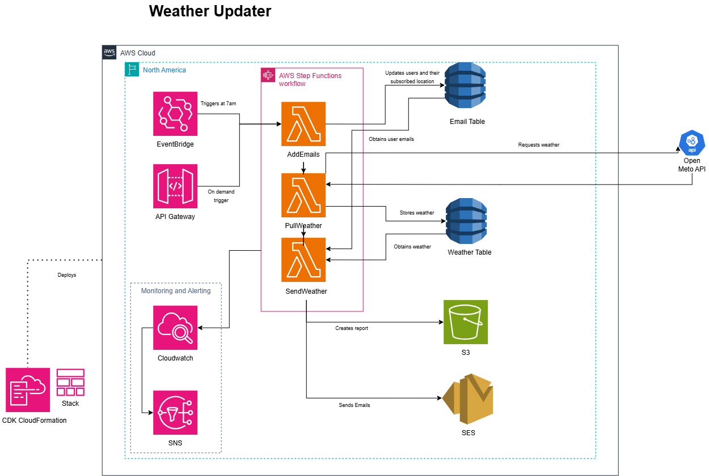

# Weather Updater
The Weather Updater is a serverless application that automatically emails users the day's weather at 7am every day. Once users are in the database, the system handles everything, from fetching the weather from a [public api](https://open-meteo.com) to emailing it out to users to archiving copies of the data for future use. 

## Architecture

The application works by having an eventbridge event at 7am, triggering the three lambda functions. These lambda functions use the information in the dynamodb databases and the weather api to create and format reports to send to users through ses and store in an s3 bucket.

## Features
Features include:
- Scheduled delivery
- Per-subscriber location personalization
- S3 archiving with timestamps
- Cloudwatch monitoring with SNS failure alerts

## Tech Stack
- Eventbridge: fires daily at 7am
- API Gateway: triggers on demand reports
- Lambda: gets weather and creates reports
- Step Functions: Triggers lambda functions sequentially
- DynamoDB: stores user and weather information
- S3: archives timestamped reports
- SES: Sends emails to users
- Cloudwatch and SNS: alerts if any part of pipeline fails

## Project Structure
The stack itself is contained in the [weather_updater_stack.py](weather_updater/weather_updater_stack.py) file, while all lambda function definitions reside in the [compute folder](weather_updater/compute).

## Estimated Costs
The application is serverless and runs within the free tier for low-user amounts. Eventbridge is free, and Lambda, S3, DynamoDB, and SES have generous free tiers. It is worth noting that, if the subscriber count were to increase, the [open meteo api](https://open-meteo.com) would require a paid subscription.
